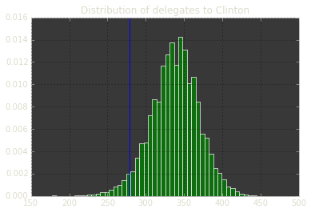

# Does Clinton have a 97% chance of winning? 

## Biases (or inefficiencies) in election prediction markets

PredictIt has several prediction markets [for the general election](https://www.predictit.org/Browse/Group/67/National). However, PredictIt also has a market for the election outcome in every state.

If we took each state's prediction market, and used it to simulate general election, what would we find? If the market is roughly efficient, we would expect the mean of simulated election outcomes to be about the same as the national election markets. Surprisingly, **I find this technique yields a 97% chance of a Clinton win**. This estimate is significantly higher than the PredictIt general election market, and higher than Rothchild's [debiased aggregate](http://predictwise.com/). 

So, are the general markets not bullish enough on Clinton, or are the state markets too bullish on Clinton? Unfortunately, I suspect the latter. A few states -- specifically, Georgia, Alaska, Arizona and Montana --  may have overpriced Clinton shares. 

Of course, I am *not* a trained economist, statistician or politican scientist. This work also suffers from a serious limitation: no access to historical trade data. If you have notes on this, or access to historical data from a prediction market, please contact me:

`ffff [at] berkeley [] edu`

**All the code for replicating these results [are available here, as a Jupyter notebook](https://github.com/elsehow/2016-election-market-simulations/blob/master/market-forecasts.ipynb)**.

## Simulating the election with market-derived probabilities

First, we'll get a prediction market from each state on PredictIt. 

Then, we need to turn the prediction market prices into probabilities. Following [Rothschild, 2009](http://researchdmr.com/RothschildPOQ2009.pdf):

> First, I take the average of the bid and ask for the stock that pays out if the Democrat wins on Election Day. If the bid-ask spread is greater than five points, I take the last sale price. If there are no active offers and no sales in the last two weeks of the race, I drop the race.

We can do this separately for both Democratic and Republican markets. We'll focus on the Clinton win outcome, corresponding to a yes in the Democratic markets and a No in the Republican markets.

We should also debias this probability. Following Leigh et al. (2007) *Is There a Favorite-Longshot Bias in Election Markets?*, Rothschild (2009) suggests `Pr = theta(1.64*theta^-1(price))`. 

However, I don't have programmatic access to historical trade data, so I cannot find date of last sale. Consequently, no races are dropped here. Without historical trade data, I also can't find a value for [theta](http://www.investopedia.com/terms/t/theta.asp) so I canot apply the favorite-longshot correction. **If anyone has access to historical PredictIt data, or historical data from any prediction market, please contact me**: `ffff [at] berkeley [] edu`

In the meantime, we'll make share prices into probabilities as best we can.

Now, we'll construct a list of all `states`, where each state has a `probability` of a Clinton win, and a number of `delegates`.


```python
def state (abbrev, delegates):
    return {"abbreviation": abbrev,
           "delegates": delegates,
           "probability": probability(abbrev),}

states_delegates = {'AL':9, 'AK':3, 'AZ':11, 'AR':6, 'CA':55, 'CO':9, 'CT':7, 'DC':3, 'DE':3, 'FL':29, 'GA':16, 'HI':4, 'ID':4, 'IL':20, 'IN':11, 'IA':6, 'KS':6, 'KY':8, 'LA':8, 'ME':4, 'MD':10, 'MA':11, 'MI':16, 'MN':10, 'MS':6, 'MO':10, 'MT':3, 'NE':5, 'NV':6, 'NH':4, 'NJ':14, 'NM':5, 'NY':29, 'NC':15, 'ND':3, 'OH':18, 'OK':7, 'OR':7, 'PA':20, 'RI':4, 'SC':9, 'SD':3, 'TN':11, 'TX':38, 'UT':6, 'VT':3, 'VA':13, 'WA':12, 'WV':5, 'WI':10, 'WY':3,} 
```

Now we can start to simulate elections. We'll use each probability to allocate delegates, or not, to Clinton. We'll do this some number of times, producing a list of Clinton delegates elected in each simulation.

```python
import random
random.seed()

def decide (probability):
    return random.random()<probability
    
def allocate_delegates (state):
    return state['delegates'] * decide(state['probability'])

def simulate_election (_):
    return sum(map(allocate_delegates, states))
    
def simulate_elections (trials):
    return map(simulate_election, range(trials))
    
num_trials = 100000
simulations = simulate_elections(num_trials)
print 'simulated ' + str(num_trials) + ' elections'
```

Now we can calculate how many of those elections Clinton won. We will count only majority wins. Electoral deadlocks will count as a loss.

```python
def winning (delegates):
    return delegates > 270

win_percent = float(len(filter(winning, simulations)))/float(num_trials)

print '% elections won by Clinton: ' + str(win_percent)
```

    % elections won by Clinton: 0.97656

Here's a distribution of the number of delegates Clinton gets in each election. The blue line represents the 270 delegates needed to win the electoral college.



#  Conclusions: Where are the biases?

Our estimated 97% chance of a Clinton win is significantly higher than the PredictIt general election market (which has about 82¢ for Clinton shares as of 10-16-16). It is also much higher than Rothchild's [debiased aggregate](http://predictwise.com/). Are the general markets not bullish enough on Clinton, or are the state markets too bullish on Clinton?

Let's assume that the national election markets, and poll-based forecasts, are roughly correct. What would it mean for the state markets to undervalue a Clinton win? Well, let's take a look at those states where market prices have an estimated 20% to 50% chance of a Clinton win.


```python
filter(lambda s: s['probability']<0.5 and s['probability']>0.2, states)
```

    [{'abbreviation': 'GA', 'delegates': 16, 'probability': 0.27},
     {'abbreviation': 'AK', 'delegates': 3, 'probability': 0.21000000000000002},
     {'abbreviation': 'AZ', 'delegates': 11, 'probability': 0.4875},
     {'abbreviation': 'UT', 'delegates': 6, 'probability': 0.225},
     {'abbreviation': 'MO', 'delegates': 10, 'probability': 0.2025}]


Excluding Utah, which has a [non-negligable chance of a 3rd-party win](http://www.nytimes.com/2016/10/15/us/politics/evan-mcmullin-campaign-utah.html?_r=0), perhaps these other states 
